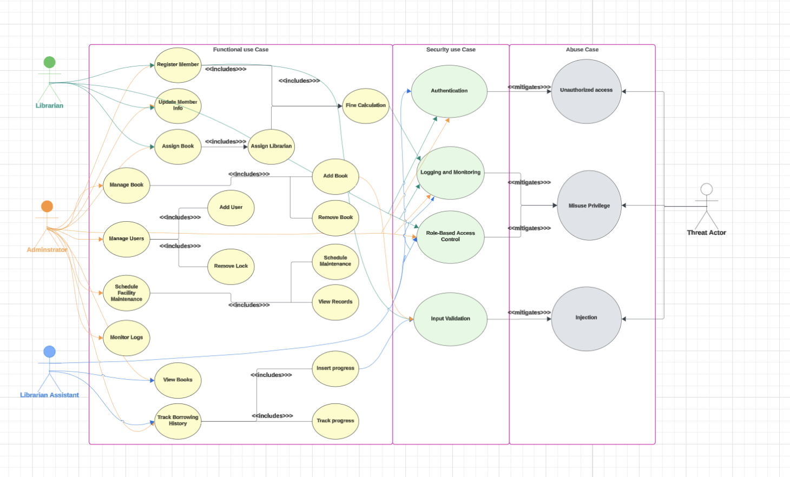
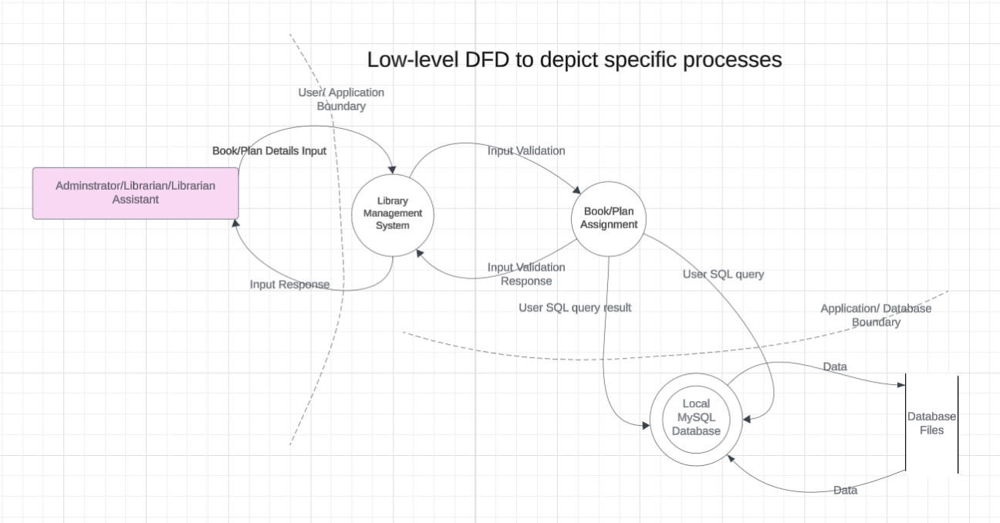
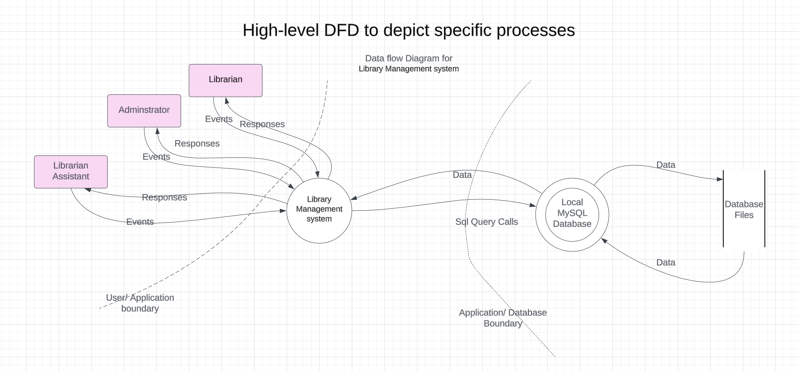
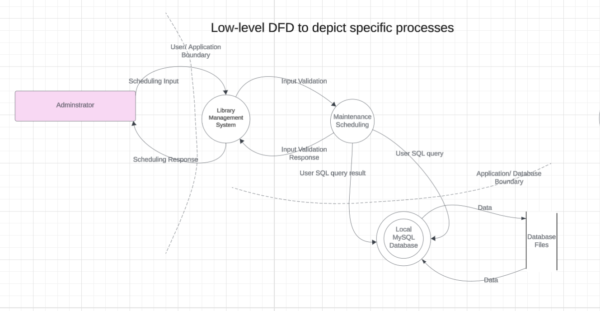
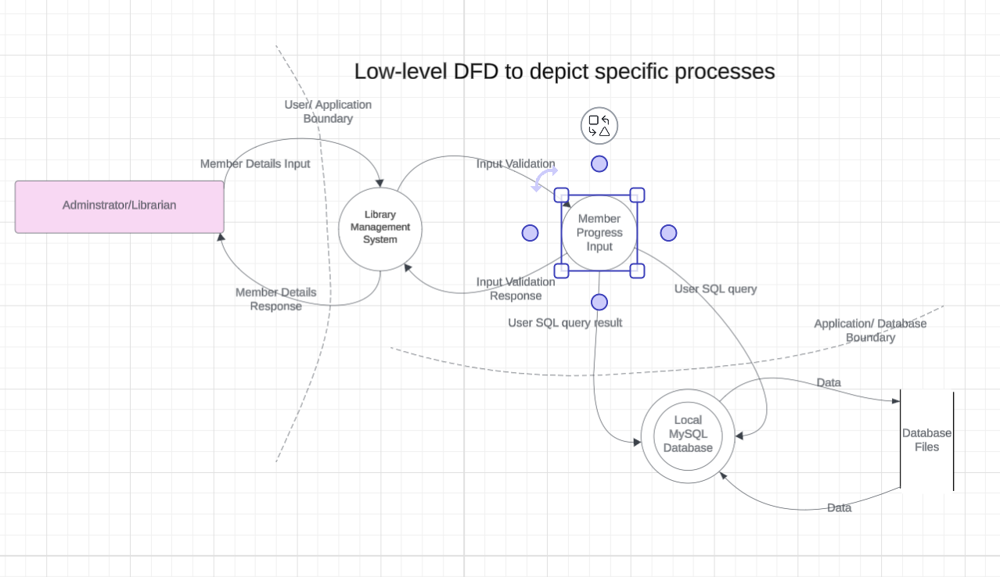
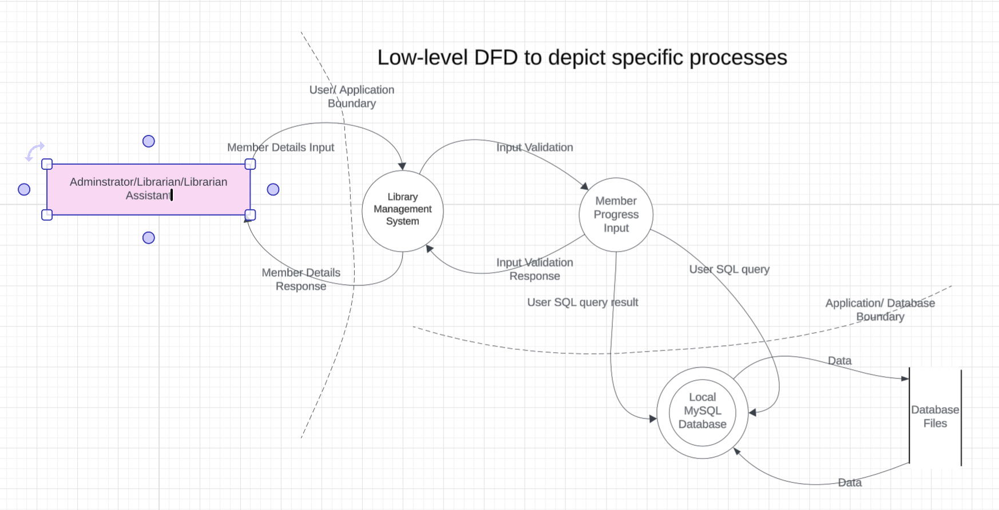
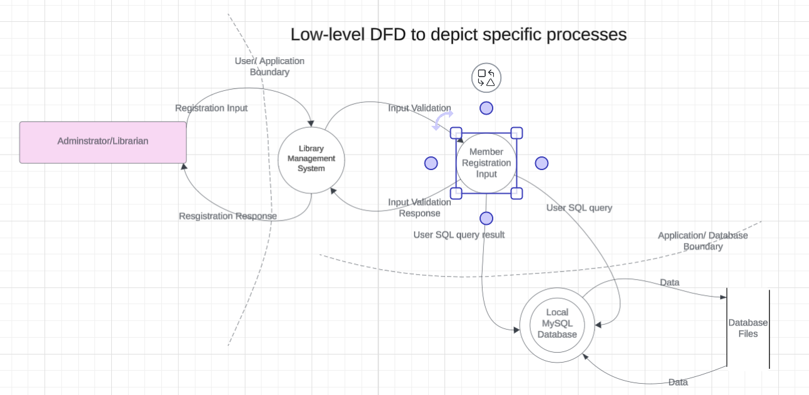
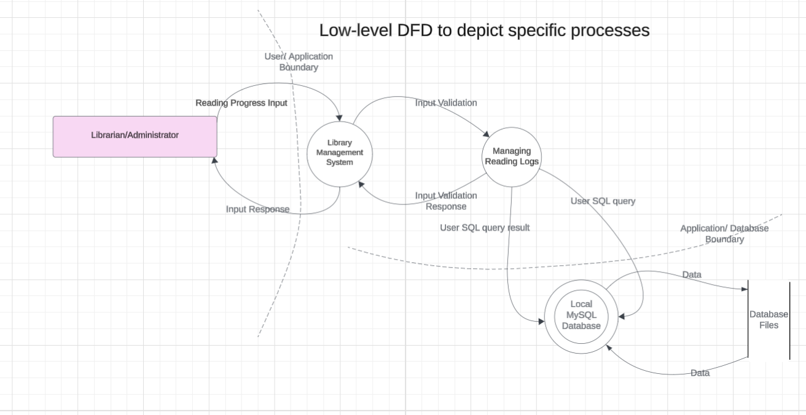
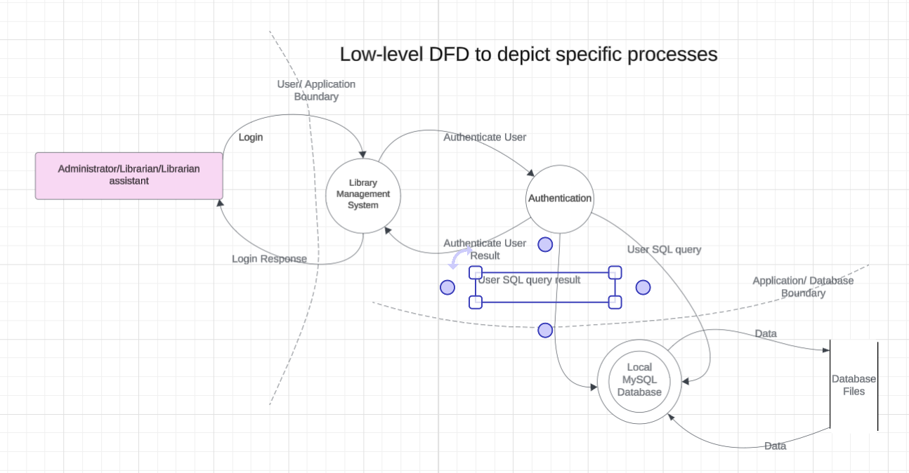
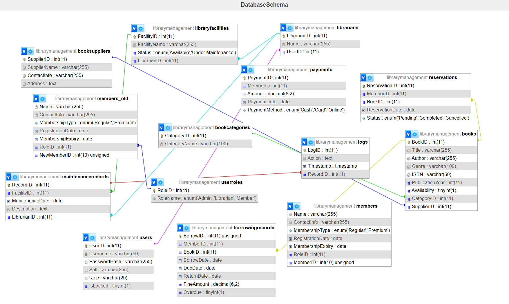

# **Secure Software Development Project - Library Management System**

## **Project Description**
The **Library Management System** is a **secure and efficient JavaFX desktop application** designed to facilitate **book lending, member management, and overdue fine tracking** while maintaining robust **security measures** throughout the **Software Development Life Cycle (SDLC)**. 

The system ensures secure interactions through **input validation, role-based access control, prepared statements for database operations, and real-time logging and monitoring.**

---

## **Technologies Used**
- **JavaFX** - GUI development  
- **MySQL** - Database for storing book and member records  
- **XAMPP** - Local database server  

---

## **Key Features**
- ✅ **Secure Library Management System** with **authentication, authorization, and logging**
- ✅ **Book lending and returns** with **due date tracking**
- ✅ **Fine calculation** for overdue books  
- ✅ **Role-Based Access Control (RBAC)** 
- ✅ **Prepared Statements & Input Validation** to prevent **SQL injection attacks**  
- ✅ **Logging & Monitoring** to track user activities  

---
## **Installation Instructions**
1️⃣ **Install JavaFX and MySQL.**  
2️⃣ **Set up the database server using XAMPP or a MySQL instance.**  
3️⃣ **Import the provided `.sql` file from `/sample_data/` to create necessary tables.**  
4️⃣ **Ensure JavaFX is properly configured in your development environment.**  

---
## 📌 Usage Instructions

📌 **Run `src/App.java` to launch the application.**

### ✅ Librarians can:
- Register new members and update their details.
- Manage book records (add, update, and delete).
- Process book checkouts and returns.
- View and track borrowing history.

### ✅ Librarian Assistant can:
- Can view and renew memberships
- Assign books and track borrowing
- View fines and member borrowing history
- Monitor facility status and maintenance
- 📌 Has **limited permissions** compared to Librarians and Admins.

### ✅ Administrators can:
- Manage users (add, lock, or delete).
- Monitor system logs.
- Enforce security policies.

---

## **Usage Instructions**
📌 **Run `src/App.java` to launch the application.

---
## **Functional & Security Requirements**
**Functional Use Cases**

---
## **Secure Design Principles and Threat Modeling**
**Data Flow Diagrams**

---
## **Threats and Mitigations**
**STRIDE Model**

| Threat                 | Description                                  |Mitigation                                  |
|---------------------------|---------------------------------------------|---------------------------------------------|
| **Spoofing**              | Unauthorized login attempts  | Implement strong authentication, account lockout mechanism |
| **Tampering**             | Altering book records     | Use role-based access control (RBAC) and audit logs |
| **Repudiation**           | Denying actions performed              | Maintain transaction logs |
| **Information Disclosure**| Exposing member details     | Encrypt sensitive data |
| **Denial of Service (DoS)**| System overload due to excessive requests   | Implement rate limiting |
| **Privilege Escalation**  | Librarian escalating privileges to admin   | Use least privilege principle |
---
## **📂 Database Structure**

